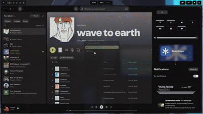

<!-- Badges -->
[](https://archlinux.org/)
[](https://hyprland.org/)
[](https://fishshell.com/)
[](https://neovim.io/)
[](https://github.com/PHNexus/Hyprland-configs/blob/main/LICENSE)
[](https://github.com/PHNexus/Hyprland-configs/commits/main)
[](https://github.com/PHNexus/Hyprland-configs)
[](https://github.com/PHNexus/Hyprland-configs/stargazers)
[](https://github.com/PHNexus/Hyprland-configs)
---

## Hyprland Rice

Welcome to my Hyprland Rice configuration! This setup is designed to provide a clean, efficient, and visually appealing desktop environment.

I use these configs daily.

#### Scrolling mode | looks like Niri

## Screenshots

| |  |
|---|---|
|   |  |

<div align="center">
 <h2>Preview</h2>
  
</div>

<br>
<br>
<hr>

| Component | Program |
|---|---|
| Terminal | [Kitty](https://github.com/kovidgoyal/kitty) |
| App Launcher | [Wofi](https://hg.sr.ht/~scoopta/wofi) |
| Status Bar | [Waybar](https://github.com/alexays/waybar) |
| Shell | [Fish](https://fishshell.com/) + [Starship](https://starship.rs/) |
| File Manager | [Thunar](https://docs.xfce.org/xfce/thunar/start) |
| Notifications & Control Center | [SwayNC](https://github.com/ErikReider/SwayNotificationCenter) |
| Wallpaper | [Awww](https://codeberg.org/LGFae/awww) |
| Idle Management | [Hypridle](https://github.com/hyprwm/hypridle) |
| Screen Lock | [Hyprlock](https://github.com/hyprwm/hyprlock) |
| Editor | [VS Code](https://code.visualstudio.com/) + [Neovim](https://neovim.io/) |
| Browser | [Helium](https://helium.computer/) |
| Display Manager (Default) | [Ly](https://codeberg.org/fairyglade/ly#systemd) |
| Dock | [dock-bar](https://github.com/PHNexus/Hyprland-configs/tree/main/dock-bar) (`quickshell`) |

## Installation

Clone the repository and run the installation script to automatically set up the dependencies and configuration files.

```bash
# Fast clone (recommended for regular users - no history)
git clone --depth=1 https://github.com/PHNexus/Hyprland-configs.git
cd Hyprland-configs
chmod +x install.sh
./install.sh
```

## [Dependencies](packages.txt)

---

## Related Projects

Other repos used by this dotfiles:

| Project | Description |
|---|---|
| [](https://github.com/PHNexus/AppManager) | Fork of https://github.com/kem-a/AppManager — AppImage installer/manager. Installed automatically by `install.sh` and used to install other AppImages. |
| [](https://github.com/PHNexus/helium-drm-fixer) | Fork of https://github.com/vikas5914/helium-drm-fixer — fixes DRM (Widevine) for the Helium browser. Run automatically by `install.sh`. |
| [](https://github.com/PHNexus/MacTahoe-icon-theme) | Fork of https://github.com/vinceliuice/MacTahoe-icon-theme — macOS Tahoe-style icon theme. Cloned directly by `install.sh` to bypass slow AUR packaging. |

## License

MIT — see [LICENSE](LICENSE).

---

# Keybinds

Modifier key (`$mainMod`) is **SUPER** (Windows key).

## Apps

| Keybind | Action |
|---|---|
| `SUPER + T` | Open terminal (`kitty`) |
| `SUPER + Space` | Toggle application launcher (`wofi`) |
| `SUPER + E` | Open file manager (`thunar`) |
| `SUPER + C` | Open VS Code (`code`) |
| `SUPER + B` | Open browser (`helium-browser`) |
| `SUPER + X` | Open music (`spotify`) |
| `SUPER + Z` | Open local AI (`helium-browser http://localhost:8080`) |
| `SUPER + V` | Clipboard history (`cliphist`) |
| `SUPER + L` | Lock screen (`hyprlock`) |
| `SUPER + N` | Toggle SwayNC control center |
| `SUPER + SHIFT + R` | Set random wallpaper |
| `SUPER + W` | Open wallpaper picker (`quickshell`) |

## Window Management

| Keybind | Action |
|---|---|
| `SUPER + Q` | Close active window |
| `SUPER + SHIFT + W` | Toggle Waybar |
| `SUPER + SHIFT + D` | Toggle Dock-Bar |
| `SUPER + S` | Toggle floating window, center and resize to `1000x600` |
| `SUPER + F11` | Toggle fullscreen |
| `SUPER + F` | Toggle maximized window |
| `SUPER + M` | Exit Hyprland |
| `SUPER + D` | Move column right (`move +col`) |
| `SUPER + A` | Move column left (`move -col`) |
| `SUPER + R` | Move active window between workspaces 1 and 6 |
| `SUPER + =` | Increase column size (`colresize +conf`) |
| `SUPER + -` | Decrease column size (`colresize -conf`) |
| `SUPER + F1` | Toggle game mode |
| `SUPER + L / J / I / K` | Move focus left / right / up / down |
| `SUPER + Left / Right` | Consume or expel window |
| `SUPER + SHIFT + Left / Right` | Move window to adjacent direction |
| `SUPER + Mouse Left` | Drag floating window |
| `SUPER + Mouse Right` | Resize floating window |

## Workspaces

| Keybind | Action |
|---|---|
| `SUPER + [1-6]` | Switch to workspace 1–6 |
| `SUPER + SHIFT + [1-6]` | Move window to workspace 1–6 |
| `SUPER + Tab` | Switch to previous workspace |
| `SUPER + ALT + Left / Right` | Cycle workspaces |
| `SUPER + Mouse Wheel Down` | Next workspace |
| `SUPER + Mouse Wheel Up` | Previous workspace |

## Window & Layout Navigation

| Keybind | Action |
|---|---|
| `ALT + Tab` | Cycle to next window |
| `ALT + SHIFT + Tab` | Cycle to previous window |
| `SUPER + ALT + L` | Cycle between scrolling, dwindle, master and monocle layouts |

## Media & Brightness

| Keybind | Action |
|---|---|
| `XF86AudioRaiseVolume` | Volume up by 5% |
| `XF86AudioLowerVolume` | Volume down by 5% |
| `XF86AudioMute` | Toggle audio mute |
| `XF86AudioMicMute` | Toggle microphone mute |
| `XF86AudioNext` | Next track |
| `XF86AudioPause` | Play / pause |
| `XF86AudioPlay` | Play / pause |
| `XF86AudioPrev` | Previous track |
| `XF86MonBrightnessUp` | Increase brightness by 5% |
| `XF86MonBrightnessDown` | Decrease brightness by 5% |

## Screenshots

| Keybind | Action |
|---|---|
| `SUPER + SHIFT + S` | Screenshot region via `hyprshot` → `~/Pictures/Screenshots` |

## Screen Recording

| Keybind | Action |
|---|---|
| `SUPER + G` | Start / stop screen recording with audio and microphone → saves recordings to `~/Videos` |
